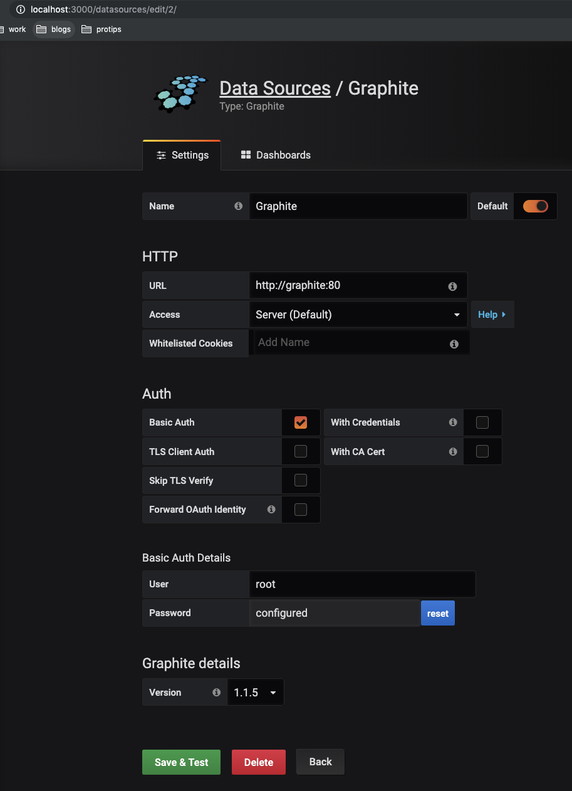

# Code Samples for `Stream Processing With Apache Spark`

# Prerequisites
```scala
val sparkVersion = "2.4.3"
libraryDependencies ++= Seq(
  "org.apache.spark" %% "spark-core",
  "org.apache.spark" %% "spark-sql"
).map(_ % sparkVersion)
```

- Get Sample Dataset
  1. `git clone https://github.com/stream-processing-with-spark/datasets.git`
  2. `cd datasets/NASA-weblogs`
  3. `tar -xvf nasa_dataset_july_1995.tgz`
  4. `mv nasa_dataset_july_1995 /tmp`

Clean up Sample Dataset:
- `rm -rf /tmp/nasa_dataset_july_1995`


### Chapter 7
1. run tcp server that delivers logs: `sbt 'runMain chapter7.TcpServerRunner'`
2. run spark job: `sbt 'runMain chapter7.NasaDatasetStreamed'`

# Metrics
    - configured in `projectRoot/metrics.properties`
- run docker-compose:
    1. `cd docker`
    2. `docker-compose up`
    
Graphite: `http://locahost`    

Grafana
- Set up Graphite as a datasource     
    1. `http://locahost:3000`
    2. `http://localhost:3000/datasources`
    3. Select 'Graphite'
    4. config:
        - url: http://graphite:80
        - Access: Server (default)
        - Select Basic Auth - Creds: root/root
        - version: 1.1.x
        